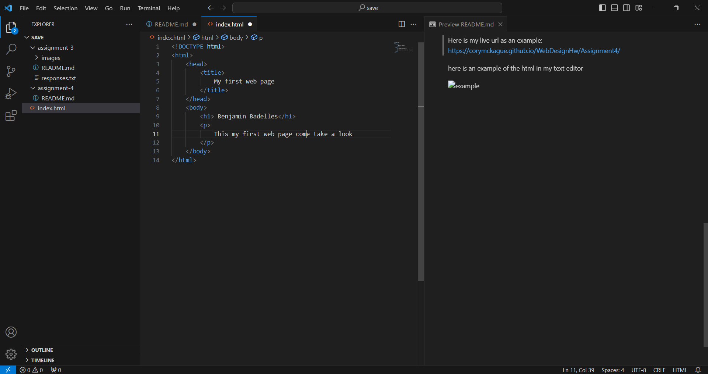

# Assignment 4

Questions:

Explain how web browsers function
-Anywhere on the internet is accessible with a web browser. It pulls data from other websites and displays it on your computer or mobile device. The Hypertext send Protocol, which outlines how text, pictures, and video are communicated on the web, is used to send the information.

Define and describe DOM
-The Document Object Model (DOM) is the data representation of the objects that comprise the structure and content of a document on the web. This guide will introduce the DOM, look at how the DOM represents an HTML document in memory and how to use APIs to create web content and applications.

What is the difference between HTML XML and XHTML? 
-All documents in the XML markup language must be correctly formatted (be "well-formed"). To make HTML more adaptable and extendable so that it could operate with different data formats (like XML), XHTML was created.

What are the 4 elements your HTML pages need? 
-<!DOCTYPE> Declaration: Specifies the document type and version of HTML being used.
html Element: The root element of an HTML document that encapsulates all other elements on the page.
head Element: Contains metadata about the document, such as the title, character encoding, and links to external resources like stylesheets and scripts.
body Element: Contains the main content of the webpage, including text, images, links, and other elements displayed to the user.

What is the index.html page for? Where does it go? 
-Usually, a website's default entry point is the "index.html" page. The "index.html" page is frequently served when a user accesses a website without providing a specific page in the URL (for example, http://www.example.com). It acts as the hub for the site's navigation and content.

Review: What are some of the best naming practices?
-Good naming practices are essential for writing clean and maintainable code. Here are some best practices for naming in web development:

Descriptive Names: Use names that clearly describe the purpose or function of variables, functions, classes, and elements in your code.
CamelCase or Snake_case: Choose a consistent naming convention (e.g., camelCase or snake_case) and stick to it throughout your codebase.
Avoid Abbreviations: Minimize the use of abbreviations and acronyms unless they are widely recognized and make the code more readable.
Use Meaningful IDs and Classes: When working with HTML and CSS, use meaningful IDs and classes to style and select elements.
Follow Language Conventions: Adhere to the naming conventions and guidelines of the programming language or framework you are using.
Be Consistent: Maintain consistency in naming across your project to make it easier for you and other developers to understand and maintain the code.

Here is my live url as an example: 
[[https://corymckague.github.io/WebDesignHw/Assignment4/](https://github.com/bjbadelles/MART341-WebDesign/blob/main/assignment-4/index.html)]([https://corymckague.github.io/WebDesignHw/Assignment4](https://github.com/bjbadelles/MART341-WebDesign/blob/main/assignment-4/index.html)/)

here is an example of the html in my text editor

